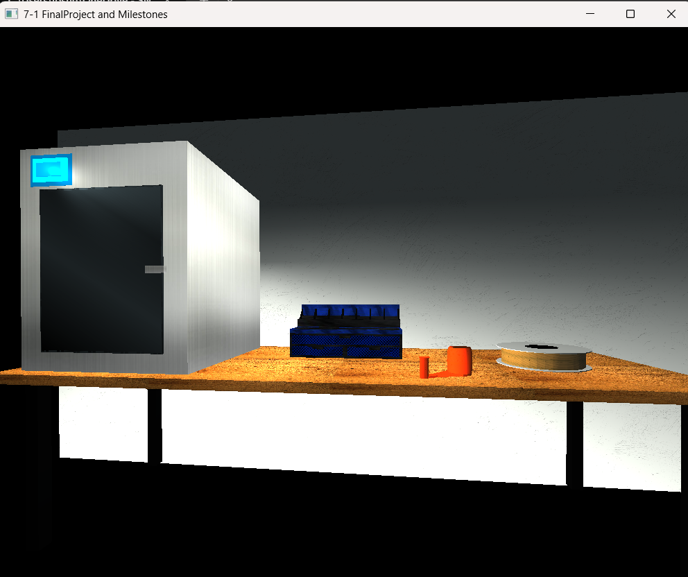

# CS-330 Comp Graphic and Visualization

## OpenGL 3D Printer Workstation

A realistic 3D workstation created with modern OpenGL and C++. This project demonstrates object modeling, transformations, textures, materials, lighting, and interactive camera controls while recreating a real-world desktop scene.

---

## Project Overview

This project was developed for CS-330 Computational Graphics and Visualization at Southern New Hampshire University. The goal was to recreate a realistic 3D environment using primitive meshes, transformations, textures, materials, lighting, and camera navigation.

The final scene models a 3D printing workstation consisting of:

- 3D printer

- Filament spool

- 3D printed storage drawer

- Wooden work surface

---

## Features

- Multiple custom 3D objects

- Texture mapping

- Material properties

- Ambient, diffuse, and specular lighting

- Interactive camera controls

- Perspective and orthographic viewing

- Modular C++ design

---

## Technologies Used

- C++

- OpenGL

- GLFW

- GLEW

- GLM

- Visual Studio 2026

---

## Reflection

### Software Design

For this project, I started by getting a clear idea of the real-world scene I wanted to recreate before I wrote any 
code. Instead of jumping right into building the workstation, I broke it down into parts: the 3D printer, filament 
spool, storage drawer, and work surface. This helped me focus on each object on its own and also think about how they 
would all come together in the final scene.

One of the main skills I learned was how to break down complex objects into simple shapes. I also got better at 
choosing the right textures, materials, lighting, and camera angles to make the scene look more realistic, instead of 
just depending on the shapes themselves.

As the project progressed, my design process became more systematic. I started with basic geometry and modifications, 
then gradually refined texture, lighting, material, and object positioning based on test results and the input of my 
instructor. I found that it is a good strategy to start with the basic form and refine it in iterations, rather than 
aiming for perfection at once.

---

### Software Development

Software Development

My development approach centers on building functionality incrementally while continuously testing changes. Throughout
this project I implemented one feature at a time, verified that it worked correctly, and then built on top of it. This 
reduced debugging complexity and made it easier to identify issues as the scene became more sophisticated.

One of the biggest development strategies I adopted during this course was creating reusable code and avoiding 
unnecessary duplication. As the project grew, I relied more heavily on helper functions, reusable mesh classes, loops, 
and modular scene construction instead of individually coding every object. This made the project easier to maintain 
and modify as new features were added.

Iteration was important during development. At almost every milestone, I went back to improve textures, adjust 
lighting, refine materials, reorganize code, and add better comments. Looking back, my process became much more 
organized compared to when I started the course. Instead of just trying to get objects rendered, I learned to balance 
how things work, how easy they are to change, how clear the code is, and how good the scene looks.

---

### Computer Science and My Future

This course helped me see how math, programming, and visual design all work together to make interactive 3D 
applications. By working with transformations, coordinate systems, lighting, textures, and camera movement, I built a 
stronger understanding of ideas that go beyond graphics programming and apply to other areas of computer science.

This project reinforced my skills in object-oriented programming, modular software design, and iterative development, 
which will help me throughout my Computer Science degree. It also introduced graphics concepts that give me a better 
foundation for future classes in simulation, visualization, game development, and computer vision.

Professionally, this experience made me more confident working with new APIs and large codebases, and it reinforced 
software engineering practices that are useful in enterprise development. Even though I mostly work with web 
technologies now, learning OpenGL has helped me solve tough technical problems, understand rendering pipelines, and 
think about software from a systems point of view. These problem-solving skills are valuable no matter what programming 
language or technology I use.
